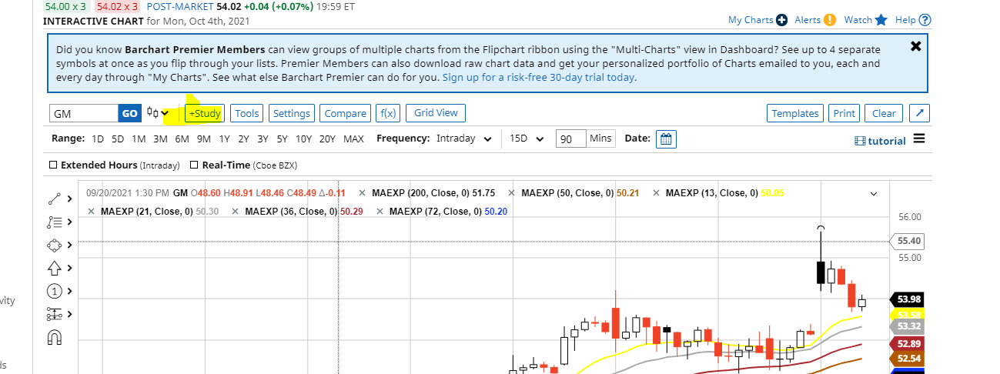
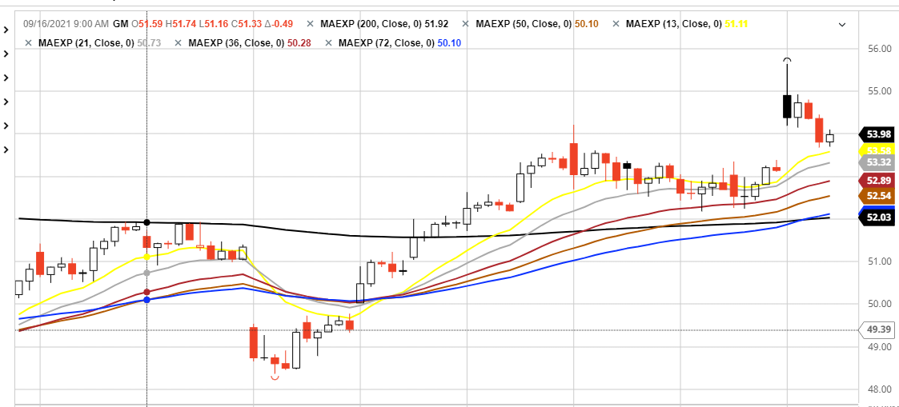
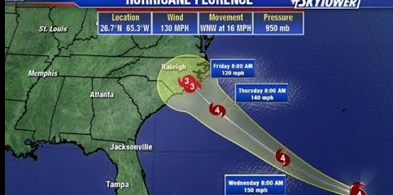
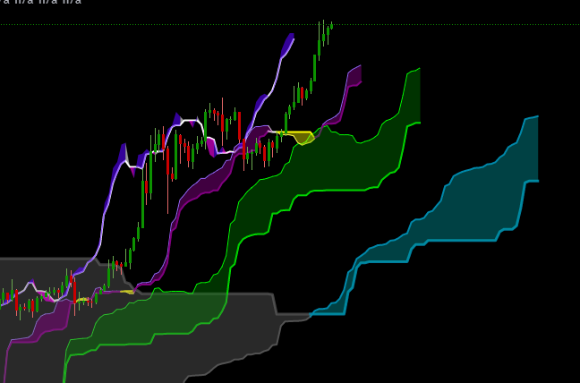
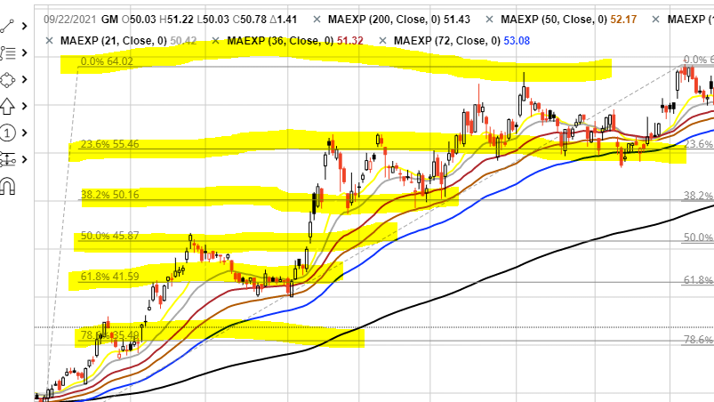

## Upcoming
- google docs step by step on how to sell /buy options

## forcasting websites 
  - barchart
  - yahoo
  - questrade
  - etrade

### Using barchart 
  - there is a  search bar 
    - it brings you to the price overview then you click on full chart to go on the full chart. 

####  **candle sticks**
  -  something about opening and close price. 
   
####   **moving averages** 
   - you go to study tools in the chart. 
   - you then choose moving average exponentials. 
   - you will then be given a form for you to insert the **period:** this is the average within an amount of days. 
   - when moving averages are in ascending order (smallest day to highest, it implies that the stock is moving in an positive direction)
   - when moving averages are in descending order ( highest to lowest, it implies that the stock is moving in a negative direciton)
   - good periods to have as pairs are 
     - 200 and 50
     - 30 and 72
   - its also good to have many periods together such as:
         - 13
         - 21
         - 36
         - 50
         - 200
     - heres an example:
       - 
#### __Ichimoku cloud__
- we can think of it like them hurricane progression forcasting things
-   both can have a cloud incidcating the two extremities of where it can go
-  
-  
  
#### __Fibonaci Retracements__
- it shows you the support/resistance lines ( or something like that)
  - support is when its about to go back up
  - resistance is when its about to go back down. 
- when doing these retracements, its good to start at year(time range) and start at the lowest of the graph to the highest
  - you can ten zoom in afterwards
-  
  
## other facts
- the year range is good for forecasting 
- the zooming in is good for day/short term trading, but day trading is dangerous because you're vulnerable to the news. 